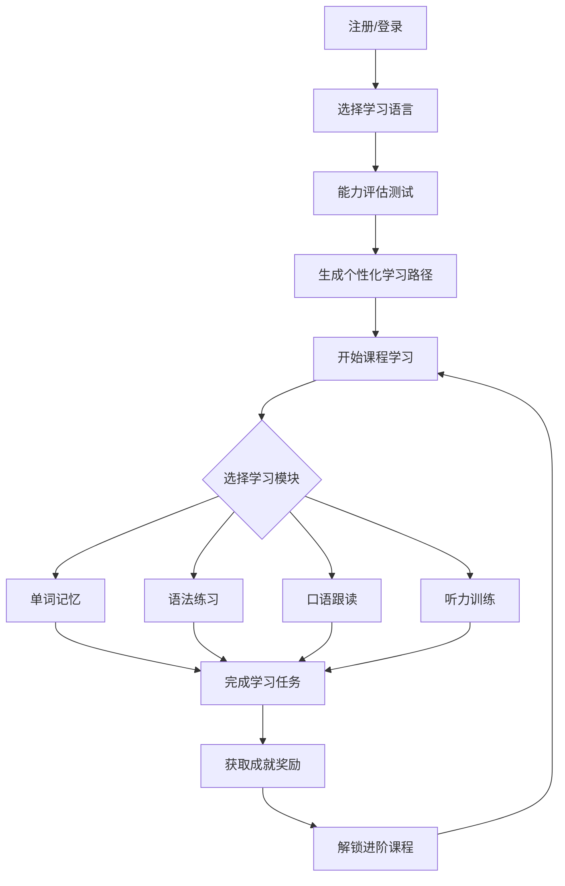
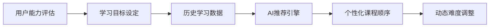

# 多语种在线教育平台 - 产品需求文档

## 1. 产品概述

LinguaFlow 是一款沉浸式多语种在线学习平台，支持英语、日语、韩语等主流语言学习。平台通过 AI 驱动的个性化学习路径、智能进度追踪和游戏化成就系统，为用户打造专业、有趣、高效的语言学习体验。

- **核心价值**：让语言学习变得触手可及、趣味盎然
- **目标用户**：语言学习爱好者、学生、职场人士、旅行爱好者
- **市场定位**：中高端语言学习市场，区别于传统背单词工具的沉浸式学习平台

## 2. 核心功能

### 2.1 用户角色

| 角色 | 注册方式 | 核心权限 |
|------|----------|----------|
| 游客 | 无需注册 | 浏览公开内容、体验demo课程 |
| 注册用户 | 邮箱/手机注册 | 完整学习功能、进度追踪、社区互动 |
| VIP用户 | 付费升级 | 高级课程、AI口语辅导、无限制学习 |

### 2.2 功能模块

1. **首页 (Landing)**：语言选择、学习数据总览、快速开始学习入口
2. **学习中心 (Learning Hub)**：分级课程体系、四大互动学习模块
3. **个人中心 (Profile)**：学习进度、学习路径、成就展示
4. **社区 (Community)**：学习小组、经验分享、问答互动
5. **成就中心 (Achievements)**：成就徽章、排行榜、学习激励

## 3. 核心流程

### 3.1 用户学习流程

### 3.2 学习路径推荐算法

## 4. 用户界面设计

### 4.1 设计风格

**设计理念**：沉浸式学习 + 东方美学 + 现代极简

**色彩体系**：
- **主色调**：
  - 英语：深蓝色 #1E3A5F（代表稳重、专业）
  - 日语：樱花粉 #FFB7C5（代表优雅、细腻）
  - 韩语：薄荷绿 #98D8C8（代表活力、清新）
- **辅助色**：深灰 #2D3436、浅灰 #F5F6FA
- **强调色**：金色 #F9CA24（成就）、红色 #E74C3C（重要提示）

**字体**：
- 标题：Noto Sans SC / Noto Sans JP / Noto Sans KR
- 正文：Inter（英文）、思源黑体（中日韩）
- 装饰：Ma Shan Zheng（书法风格）

**布局风格**：
- 卡片式布局，模块化设计
- 顶部固定导航 + 侧边栏学习进度
- 圆角设计（border-radius: 16px）
- 微妙的阴影层次感

**动效**：
- 页面切换：平滑渐入（300ms ease-out）
- 卡片悬停：轻微上浮 + 阴影加深
- 进度条：流畅填充动画
- 成就解锁：粒子庆祝动画

### 4.2 页面设计概览

| 页面 | 模块名称 | UI元素 |
|------|----------|--------|
| 首页 | 语言切换器 | 语言图标、选择动画、渐变背景 |
| 首页 | 学习数据仪表盘 | 环形进度图、连续学习天数、学习统计卡片 |
| 首页 | 快捷学习入口 | 悬浮按钮、推荐课程卡片、渐变边框 |
| 学习中心 | 课程列表 | 卡片式布局、难度星级、进度条、锁定状态 |
| 学习中心 | 学习模块入口 | 四大模块图标、模块描述、学习统计 |
| 单词记忆 | 闪卡系统 | 翻转动画、例句展示、发音按钮、记忆曲线 |
| 语法练习 | 交互题库 | 选择题、填空题、拖拽题、即时反馈 |
| 口语跟读 | AI评测 | 波形动画、录音按钮、评分展示、对比播放 |
| 听力训练 | 听写系统 | 音频播放器、文本输入、答案解析 |
| 个人中心 | 学习报告 | 雷达图、周报图表、成就墙 |
| 社区 | 动态流 | 用户头像、内容卡片、点赞评论、话题标签 |
| 成就中心 | 徽章墙 | 成就图标、获取进度、排行榜 |

### 4.3 响应式策略

- **桌面端 (≥1200px)**：三栏布局，侧边栏固定导航
- **平板端 (768px-1199px)**：两栏布局，底部导航
- **移动端 (<768px)**：单栏布局，底部 Tab 导航，支持手势操作

## 5. 功能详细说明

### 5.1 分级课程体系

- **难度等级**：入门(A1)、基础(A2)、进阶(B1)、中级(B2)、高级(C1)、精通(C2)
- **课程分类**：日常对话、商务沟通、旅游出行、文化习俗、学术专业
- **每级课程数**：每个难度 20 个单元，每个单元包含 10 个课时
- **解锁机制**：完成前一单元 80% 学习进度解锁下一单元

### 5.2 互动学习模块

#### 单词记忆
- 智能闪卡：单词+发音+例句+图片联想
- 记忆曲线：基于艾宾浩斯遗忘曲线自动安排复习
- 拼写训练：听音拼写、字母补全
- 词汇量测试：定期评估用户词汇水平

#### 语法练习
- 交互式练习题：选择题、填空题、排序题、改错题
- 即时反馈：正确答案解析、错误原因说明
- 语法图解：可视化语法结构展示
- 例句库：真实语境例句

#### 口语跟读
- AI 语音评测：发音准确度、流利度、语调评分
- 场景对话：模拟真实对话场景
- 录音回放：对比原音和跟读音频
- 跟读挑战：排行榜激励

#### 听力训练
- 音频播放：变速播放、循环播放、段落复读
- 听写模式：音频填空、整体听写
- 听力理解：选择题测试、问答练习
- 字幕支持：双语字幕、隐藏字幕、纯音频模式

### 5.3 学习进度追踪

- **实时统计**：今日学习时长、学习单词数、练习正确率
- **周报/月报**：学习趋势图表、能力雷达图
- **连续学习**：每日打卡、连续天数统计
- **目标设定**：自定义学习目标、里程碑提醒

### 5.4 个性化学习路径

- **能力评估**：入学测试确定初始等级
- **智能推荐**：基于学习数据动态调整课程顺序
- **薄弱点强化**：自动识别语法/词汇薄弱点重点复习
- **学习节奏**：根据用户空闲时间推荐最佳学习时段

### 5.5 社区交流系统

- **学习小组**：按语言/目标组建学习群组
- **经验分享**：学习心得、方法讨论
- **问答互助**：疑难解答、学习伙伴匹配
- **话题广场**：热门话题、每日讨论

### 5.6 成就激励系统

- **成就徽章**：学习里程碑徽章、技能徽章、稀有徽章
- **等级制度**：学习者等级、学习天数等级
- **排行榜**：周排行、月排行、全站排行
- **虚拟奖励**：学习金币、称号解锁、头像框

## 6. 数据模型

### 6.1 核心数据实体

| 实体 | 说明 |
|------|------|
| User | 用户信息、角色、学习偏好 |
| Language | 支持的语言类型 |
| Course | 课程信息、难度等级 |
| Lesson | 课时内容、学习材料 |
| Progress | 用户学习进度、完成状态 |
| Achievement | 成就定义、获取条件 |
| UserAchievement | 用户已获得成就 |
| CommunityPost | 社区动态、评论、点赞 |
| SpeakingRecord | 口语录音、评分记录 |
