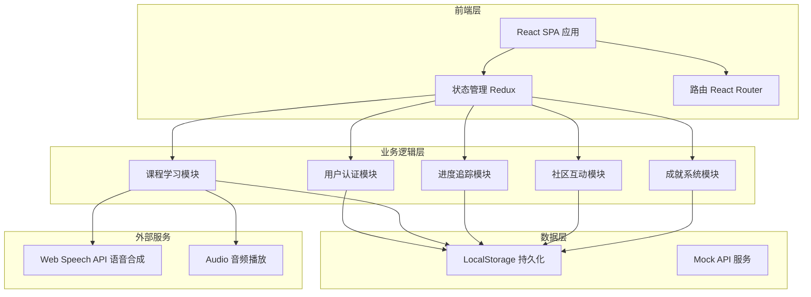
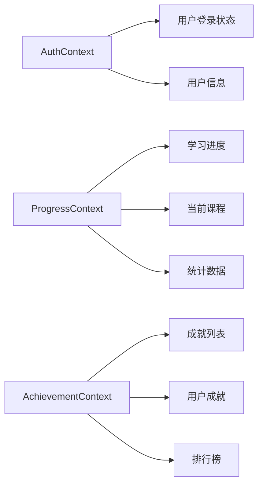

# 多语种在线教育平台 - 技术架构文档

## 1. 架构设计



## 2. 技术选型

| 类别 | 技术栈 | 版本 |
|------|--------|------|
| 框架 | React | 18.x |
| 构建工具 | Vite | 5.x |
| 样式方案 | Tailwind CSS | 3.x |
| 路由管理 | React Router DOM | 6.x |
| 状态管理 | React Context + useReducer | - |
| 动画库 | Framer Motion | 11.x |
| 图表库 | Recharts | 2.x |
| 图标库 | Lucide React | Latest |
| 存储方案 | LocalStorage | - |

## 3. 路由定义

| 路由 | 页面 | 描述 |
|------|------|------|
| `/` | LandingPage | 首页，语言选择，学习入口 |
| `/login` | LoginPage | 用户登录 |
| `/register` | RegisterPage | 用户注册 |
| `/learn` | LearningHub | 学习中心主页 |
| `/learn/:language` | CourseList | 课程列表页 |
| `/learn/:language/:courseId` | CourseDetail | 课程详情页 |
| `/module/vocabulary` | VocabularyModule | 单词记忆模块 |
| `/module/grammar` | GrammarModule | 语法练习模块 |
| `/module/speaking` | SpeakingModule | 口语跟读模块 |
| `/module/listening` | ListeningModule | 听力训练模块 |
| `/profile` | ProfilePage | 个人中心 |
| `/community` | CommunityPage | 社区页面 |
| `/achievements` | AchievementsPage | 成就中心 |

## 4. 数据模型定义

### 4.1 用户数据

```typescript
interface User {
  id: string;
  email: string;
  nickname: string;
  avatar: string;
  role: 'guest' | 'user' | 'vip';
  preferredLanguages: string[];
  currentLanguage: string;
  currentLevel: string;
  createdAt: string;
  streak: number;
  totalXP: number;
  level: number;
}
```

### 4.2 课程数据

```typescript
interface Course {
  id: string;
  language: 'english' | 'japanese' | 'korean';
  title: string;
  description: string;
  level: 'A1' | 'A2' | 'B1' | 'B2' | 'C1' | 'C2';
  category: 'daily' | 'business' | 'travel' | 'culture' | 'academic';
  totalLessons: number;
  completedLessons: number;
  isLocked: boolean;
  imageUrl: string;
}
```

### 4.3 课时数据

```typescript
interface Lesson {
  id: string;
  courseId: string;
  title: string;
  type: 'vocabulary' | 'grammar' | 'speaking' | 'listening' | 'mixed';
  duration: number;
  content: LessonContent;
  isCompleted: boolean;
  score?: number;
}

interface LessonContent {
  words?: Word[];
  grammarPoints?: GrammarPoint[];
  dialogues?: Dialogue[];
  audioUrl?: string;
  exercises?: Exercise[];
}
```

### 4.4 学习进度

```typescript
interface LearningProgress {
  userId: string;
  language: string;
  vocabularyMastered: number;
  grammarMastered: number;
  speakingAccuracy: number;
  listeningAccuracy: number;
  totalStudyTime: number;
  weeklyProgress: WeeklyStats[];
}
```

### 4.5 成就数据

```typescript
interface Achievement {
  id: string;
  title: string;
  description: string;
  icon: string;
  category: 'learning' | 'streak' | 'skill' | 'rare';
  requirement: {
    type: string;
    value: number;
  };
}

interface UserAchievement {
  achievementId: string;
  userId: string;
  unlockedAt: string;
}
```

## 5. 组件架构

```
src/
├── components/
│   ├── common/          # 通用组件
│   │   ├── Button
│   │   ├── Card
│   │   ├── Modal
│   │   ├── ProgressBar
│   │   └── Avatar
│   ├── layout/          # 布局组件
│   │   ├── Header
│   │   ├── Sidebar
│   │   ├── Footer
│   │   └── Navigation
│   ├── learning/        # 学习相关组件
│   │   ├── FlashCard
│   │   ├── VocabularyBuilder
│   │   ├── GrammarExercise
│   │   ├── SpeakingRecorder
│   │   ├── ListeningPlayer
│   │   └── ProgressChart
│   ├── community/       # 社区组件
│   │   ├── PostCard
│   │   ├── CommentSection
│   │   └── UserBadge
│   └── achievement/     # 成就组件
│       ├── BadgeGrid
│       ├── AchievementCard
│       └── Leaderboard
├── pages/
│   ├── Home
│   ├── Auth
│   ├── Learning
│   ├── Profile
│   ├── Community
│   └── Achievements
├── hooks/
│   ├── useAuth
│   ├── useProgress
│   ├── useAchievements
│   └── useLearning
├── context/
│   ├── AuthContext
│   ├── ProgressContext
│   └── AchievementContext
├── services/
│   ├── storageService    # LocalStorage 操作
│   ├── mockDataService   # 模拟数据服务
│   └── speechService     # 语音服务封装
├── utils/
│   ├── helpers
│   ├── constants
│   └── formatters
└── data/
    └── mockData.ts       # 模拟课程数据
```

## 6. 状态管理架构



## 7. Mock 数据策略

### 7.1 课程数据
- 预置英语、日语、韩语各 3 个难度级别的示例课程
- 每个课程包含 5-10 个课时
- 包含词汇、语法、口语、听力混合内容

### 7.2 用户数据
- LocalStorage 存储用户登录状态
- 学习进度实时保存
- 成就解锁状态追踪

### 7.3 社区数据
- 预置示例帖子和评论
- 支持用户发帖和互动

## 8. 性能优化

- **路由懒加载**：使用 React.lazy 实现页面级代码分割
- **图片优化**：使用 WebP 格式，支持加载占位
- **动画性能**：使用 CSS transform 和 opacity 实现动画
- **状态缓存**：合理使用 useMemo 和 useCallback
